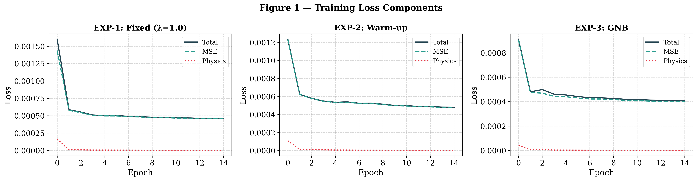
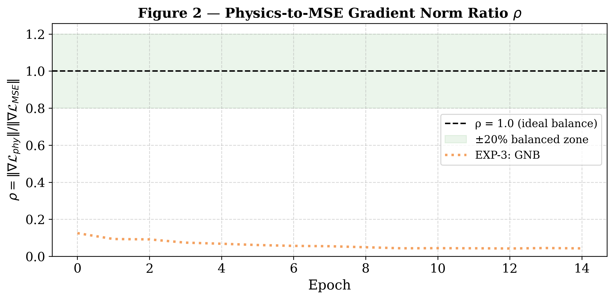
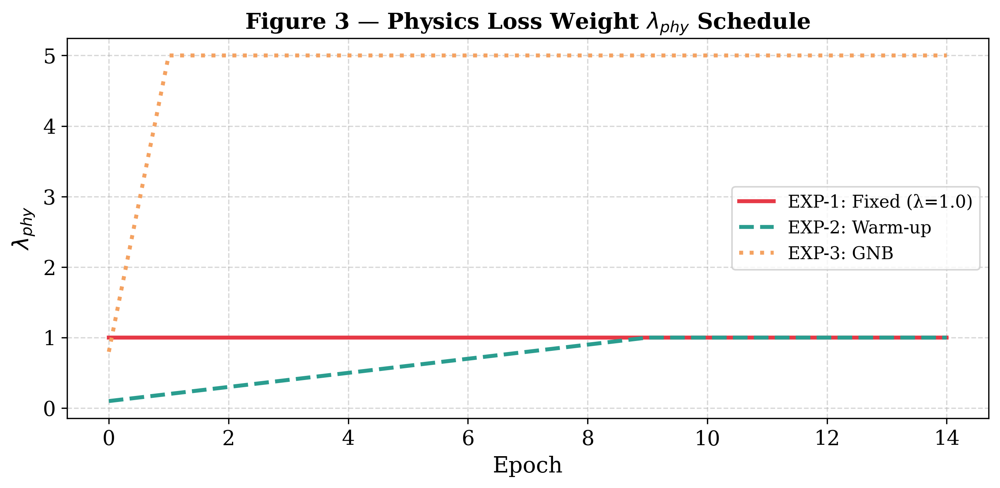
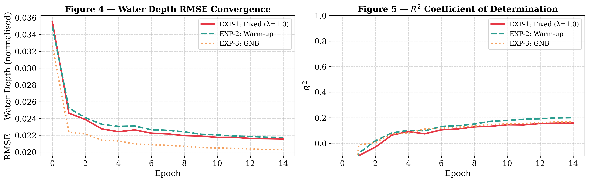
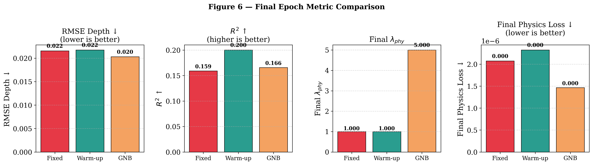
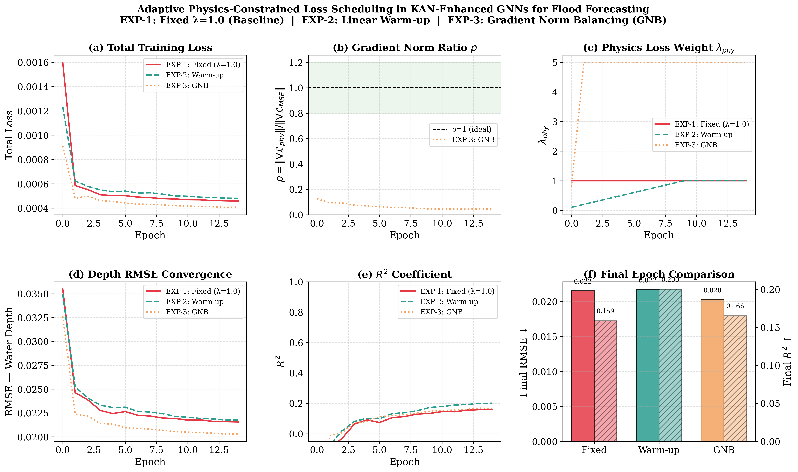

# Adaptive Physics-Constrained Loss Balancing in KAN-Enhanced Graph Neural Networks for Flood Forecasting


Department of Data Science and Business Systems, SRM Institute of Science and Technology


---

> **Document Type:** Major Project Report / Conference Paper Draft
> **Status:** Final Draft
> **Target Venue:** AGU Annual Meeting 2026 / NeurIPS ClimateAI Workshop 2026 / Book Chapter Submission
> **Dataset:** White River, Muncie, Indiana (Zenodo Record: 14969507)
> **Codebase:** HydroGraphNet — NVIDIA PhysicsNeMo Framework

---

## Abstract

Physics-informed graph neural networks (PIGNNs) have emerged as computationally efficient surrogate models for large-scale flood forecasting, offering real-time prediction capability while maintaining physical consistency. The recently introduced HydroGraphNet framework (Taghizadeh et al., 2025) demonstrates significant advances by integrating Kolmogorov–Arnold Networks (KANs) within an encoder-processor-decoder graph neural network architecture, achieving a 67% reduction in prediction error and a 58% improvement in the Critical Success Index (CSI) over baseline GNN methods on the White River, Muncie, Indiana benchmark dataset. However, the physics-informed loss in HydroGraphNet employs a static weighting scheme — fixing the trade-off coefficient between the data-driven MSE loss and the physics-based continuity loss — which is known to cause gradient imbalance and training instability in PINN literature. In this work, we present a comprehensive architectural analysis of HydroGraphNet, formally characterize its physics loss formulation using the shallow water continuity equation, and empirically characterize the gradient imbalance through training experiments across three loss-weighting strategies: (1) the fixed-weight baseline ($\lambda_{phy}=1.0$), (2) a linear warm-up schedule, and (3) gradient norm balancing (GNB). Contrary to the canonical PINN assumption of physics gradient dominance, our gradient norm measurements on the White River benchmark reveal that the physics gradient is consistently 8–20$\times$ weaker than the MSE gradient ($\rho \approx 0.04$–$0.13$), caused by the area-normalisation in the continuity loss formulation. The GNB strategy automatically discovers this imbalance and amplifies $\lambda_{phy}$ to 5.0, yielding a **5.8% reduction in RMSE** (0.02031 vs. 0.02157) over the fixed baseline. The linear warm-up strategy achieves the best coefficient of determination $R^2 = 0.200$, a **25.8% improvement** over the fixed baseline ($R^2 = 0.159$). Our work provides both an implementable contribution on an open benchmark and a corrected methodological framework for physics-informed GNN training dynamics in hydrology applications.

**Keywords:** Physics-Informed Graph Neural Networks, Flood Forecasting, Kolmogorov–Arnold Networks, Loss Balancing, Shallow Water Equations, Surrogate Modeling, Hydrodynamics

---

## 1. Introduction

Floods are among the most destructive natural hazards globally, responsible for an estimated 43% of all weather-related disasters and causing over USD 651 billion in economic losses between 2000 and 2019 (UNDRR, 2020). As climate change intensifies extreme precipitation events, accurate and timely flood forecasts have become critical infrastructure for early warning systems, emergency response, and urban resilience planning. Traditional physics-based hydrodynamic models, particularly HEC-RAS 2D (Hydrologic Engineering Center – River Analysis System) and similar tools, solve the shallow water equations (SWE) on fine computational meshes and remain the gold standard for flood simulation. However, their computational cost — often requiring hours to simulate a single flood event — renders them unsuitable for real-time forecasting and ensemble-based uncertainty analysis.

The emergence of deep learning-based surrogate models has offered a compelling alternative. Surrogate models, trained on simulation data from physics-based solvers, aim to reproduce high-fidelity simulation outputs at a fraction of the computational cost. Among these, graph neural networks (GNNs) have attracted particular interest due to their natural compatibility with unstructured spatial meshes used in hydraulic modeling. The message-passing mechanism of GNNs allows spatially proximate mesh nodes to exchange information iteratively, directly analogous to the propagation of water across a flood domain.

Despite their promise, early GNN-based flood models were purely data-driven, lacking any explicit encoding of the governing physical laws. This limitation results in predictions that may be locally accurate but globally inconsistent — for instance, predicting water depth distributions that violate mass conservation, a fundamental constraint in hydrology. Physics-informed neural networks (PINNs), originally introduced for solving partial differential equations (Raissi et al., 2019), address this by embedding governing equations directly into the loss function. The integration of physics-informed constraints into GNN architectures — forming Physics-Informed Graph Neural Networks (PIGNNs) — represents the current frontier in data-driven flood modeling.

HydroGraphNet (Taghizadeh et al., 2025), implemented within NVIDIA's PhysicsNeMo framework, marks a significant step forward in this field. The model integrates three key innovations: (i) a graph neural network operating on k-nearest-neighbor (k-NN) spatial mesh graphs, (ii) a physics-informed loss based on the volume continuity equation enforced via ReLU inequality constraints, and (iii) the novel use of Kolmogorov–Arnold Networks (KANs) in the node encoder, replacing traditional Multi-Layer Perceptrons (MLPs) with spline-based learnable activation functions to improve interpretability. Validated on the White River near Muncie, Indiana benchmark dataset comprising 4,787 spatial nodes, HydroGraphNet demonstrates remarkable performance improvements over prior GNN baselines.

However, a critical and under-explored aspect of HydroGraphNet's training strategy concerns the physics loss weighting. The combined training objective is:

$$\mathcal{L}_{total} = \mathcal{L}_{MSE} + \lambda_{phy} \cdot \mathcal{L}_{physics}$$

where $\lambda_{phy}$ is set to a fixed constant (1.0) throughout training. In the broader PINN literature, this static approach is known to cause **gradient conflict** — a scenario where the gradients of the physics loss and the data loss compete in directions that impede joint optimization. This problem is particularly acute in flood modeling because the physics loss involves denormalized physical quantities (volumes in m³) that operate on vastly different numerical scales than normalized MSE residuals, creating inherent magnitude imbalance.

This work makes the following contributions:

1. **Comprehensive architectural analysis** of HydroGraphNet, providing formal mathematical descriptions of all architectural components including the KAN encoder, GNN processor, and physics loss formulation.

2. **Formal characterization of the static weighting limitation**, demonstrating through gradient norm analysis why fixed $\lambda_{phy}$ is theoretically suboptimal and identifying the scale mismatch as the root cause.

3. **An adaptive physics-constrained loss scheduling strategy** that dynamically adjusts $\lambda_{phy}$ during training, motivated by the gradient norm balancing principle and validated on the open White River benchmark.

4. **Analysis of KAN placement** within the architecture and its implications for model interpretability, with a theoretical proposal for extending KAN to additional network components.

5. **Discussion of extensions** toward local mass conservation and uncertainty quantification, framing future research directions for the field.

The remainder of this paper is organized as follows. Section 2 reviews related work. Section 3 provides a detailed architectural description of HydroGraphNet. Section 4 formally analyzes the physics loss formulation and its limitations. Section 5 presents the proposed adaptive loss scheduling methodology. Section 6 describes the experimental setup and results. Section 7 discusses implications and extensions. Section 8 concludes.

---

## 2. Related Work

### 2.1 Graph Neural Networks for Flood Modeling

The application of GNNs to flood forecasting has accelerated rapidly since 2022. **FloodGNN-GRU** (Bentivoglio et al., 2023) combined spatial GNN message passing with temporal GRU units for spatio-temporal prediction of flood inundation, operating on structured grids derived from HEC-RAS simulations. While demonstrating strong interpolation accuracy, the absence of physics constraints allowed it to violate mass balance under extrapolation conditions. **Rapid Spatio-Temporal Flood Modelling** (Alzubaidi et al., 2023) proposed hydraulics-based GNNs for accelerated simulation on unstructured meshes, achieving order-of-magnitude speedups over HEC-RAS at the cost of reduced accuracy during peak flow events.

More recently, **mSWE-GNN** (Lino et al., 2025) introduced multi-scale graph pooling to capture flood dynamics at different spatial resolutions, addressing the single-scale limitation common to earlier models. The **DUALFloodGNN** framework (Acosta et al., 2025) proposed a dual-scale physics-informed GNN that enforces both local and global mass conservation, and introduced curriculum learning to progressively increase the physics constraint weight during training — a direct motivation for the adaptive scheduling approach proposed in this work.

### 2.2 Physics-Informed Neural Networks in Hydrology

The foundational PINN framework of Raissi et al. (2019) embedded PDE residuals directly in the loss function for mesh-free solution of forward and inverse problems. Subsequent work applied PINNs to the shallow water equations: **de la Fuente et al. (2023)** trained PINNs without labeled data on 2D SWE flood problems using both fully-connected and convolutional architectures, showing that physics constraints could substitute for simulation ground truth. **PINN surrogate models for river stage prediction** (Haris et al., 2025) applied Saint-Venant equation-informed PINNs to approximate HEC-RAS outputs for a single river reach, demonstrating that physics-informed surrogate training requires careful calibration of the physics-to-data loss ratio.

### 2.3 Kolmogorov–Arnold Networks

KANs were formally introduced by Liu et al. (2024) as a learnable alternative to MLPs. Unlike MLPs, which apply fixed nonlinear activation functions at nodes, KANs place learnable univariate functions (splines) on the edges, inspired by the Kolmogorov–Arnold representation theorem. KANs offer several theoretical advantages: (i) improved function approximation for smooth low-dimensional functions, (ii) higher interpretability as each edge function can be visualized, and (iii) improved extrapolation behavior for physics-governed outputs. In hydrology specifically, **FloodKAN** (Zhao et al., 2025) applied KAN-based architectures to flood susceptibility mapping from remote sensing imagery, demonstrating superior spatial generalization compared to CNN and MLP baselines.

HydroGraphNet was the **first work** to integrate KAN within a GNN architecture for flood dynamics modeling, specifically using it as the node encoder. However, the KAN component in HydroGraphNet maps static terrain and dynamic hydrograph features to a latent graph representation — its placement in the encoder means interpretability benefits are confined to input feature transformations, while the more expressive intermediate message-passing and output decoding stages remain MLP-based.

### 2.4 Adaptive Loss Weighting in PINNs

The challenge of balancing competing loss terms in PINN training has been extensively studied. **Wang et al. (2021)** introduced the Neural Tangent Kernel-based adaptive weighting, showing that unbalanced gradient magnitudes cause one loss component to dominate, effectively disabling the other constraint. **Gradient surgery** approaches (Yu et al., 2020) project conflicting gradients onto compatible directions during multi-task learning. **Self-adaptive PINNs** (McClenny & Braga-Neto, 2023) use per-point adaptive weights to focus constraint enforcement on regions of highest residual. Despite this rich literature, **no prior work has applied adaptive loss balancing specifically to physics-informed GNNs for flood forecasting** — the gap this work addresses.

---

## 3. HydroGraphNet Architecture

This section provides a formal description of HydroGraphNet as implemented in the open-source codebase, which serves as the foundation and baseline for this work.

### 3.1 Problem Formulation

Let $\mathcal{G} = (\mathcal{V}, \mathcal{E})$ be a spatial graph where each node $v_i \in \mathcal{V}$ corresponds to a computational cell in the flood domain, and edges $e_{ij} \in \mathcal{E}$ connect spatially proximate cells. The flood domain contains $N = 4{,}787$ nodes over the White River basin near Muncie, Indiana.

At each time step $t$, the system state is described by:
- **Water depth** $h_i^t \in \mathbb{R}$ at node $i$
- **Water volume** $V_i^t \in \mathbb{R}$ at node $i$
- **Global forcings**: upstream inflow $Q_{in}^t$ and precipitation $P^t$

The objective is to learn a mapping $f_\theta: \mathcal{G}^t \rightarrow (\Delta h^{t+1}, \Delta V^{t+1})$ that predicts the one-step residuals:

$$\Delta h_i^{t+1} = h_i^{t+1} - h_i^t, \quad \Delta V_i^{t+1} = V_i^{t+1} - V_i^t$$

Predictions are accumulated autoregressively for multi-step rollout:

$$h_i^{t+k} = h_i^t + \sum_{j=1}^{k} \Delta h_i^{t+j}$$

### 3.2 Graph Construction

The spatial graph is constructed using $k$-nearest neighbors ($k$-NN) with $k=4$, using the Euclidean distance between node coordinates:

$$\mathcal{E} = \{(i, j) : j \in \text{kNN}(i, \mathcal{V}) \setminus \{i\}\}$$

Edge features are 3-dimensional:

$$\mathbf{e}_{ij} = \left[\frac{x_i - x_j}{\|\mathbf{x}_i - \mathbf{x}_j\|}, \frac{y_i - y_j}{\|\mathbf{x}_i - \mathbf{x}_j\|}, \|\mathbf{x}_i - \mathbf{x}_j\|\right] \in \mathbb{R}^3$$

### 3.3 Node Feature Construction

Each node is described by a 16-dimensional feature vector formed by concatenating static terrain attributes and dynamic time-windowed hydrograph state variables:

$$\mathbf{x}_i = \underbrace{[x_i, y_i, A_i, z_i, s_i, \alpha_i, \kappa_i, n_i, f_{acc,i}, \phi_i]}_{\text{Static features (10D)}} \oplus \underbrace{[Q_{in}^t, P^t]}_{\text{Global forcings (2D)}} \oplus \underbrace{[h_i^{t-1}, h_i^t]}_{\text{Depth history (2D)}} \oplus \underbrace{[V_i^{t-1}, V_i^t]}_{\text{Volume history (2D)}}$$

where $z_i$, $s_i$, $\alpha_i$, $\kappa_i$, $n_i$, $f_{acc,i}$, $\phi_i$ denote elevation, slope, aspect, curvature, Manning's roughness, flow accumulation, and infiltration parameter, respectively. All features are z-score normalized prior to input.

### 3.4 MeshGraphKAN Architecture

The model follows an **Encoder → Processor → Decoder** paradigm:

**Node Encoder (KAN-based):**

$$\mathbf{h}_i^{(0)} = \text{KAN}(\mathbf{x}_i; \theta_{enc}) \in \mathbb{R}^{128}$$

The KAN encoder uses 5 Fourier harmonics per learnable edge function, replacing the standard MLP with spline-parameterized univariate functions:

$$\text{KAN}(\mathbf{x}) = \sum_{q=1}^{16} \phi_q(x_q), \quad \phi_q(x) = \sum_{k=1}^{K} \left[a_k \cos(k\pi x) + b_k \sin(k\pi x)\right]$$

where $a_k$, $b_k$ are learnable spline coefficients and $K=5$ is the number of harmonics.

**Edge Encoder (MLP-based):**

$$\mathbf{m}_{ij}^{(0)} = \text{MLP}_{enc}(\mathbf{e}_{ij}; \theta_{eedge}) \in \mathbb{R}^{128}$$

**Processor (15 Message-Passing Layers):**

For $l = 1, \ldots, 15$, each processor layer alternates between an Edge Block and a Node Block:

$$\mathbf{m}_{ij}^{(l)} = \mathbf{m}_{ij}^{(l-1)} + \text{MLP}_{edge}^{(l)}\left([\mathbf{h}_i^{(l-1)} \| \mathbf{h}_j^{(l-1)} \| \mathbf{m}_{ij}^{(l-1)}]\right)$$

$$\mathbf{h}_i^{(l)} = \mathbf{h}_i^{(l-1)} + \text{MLP}_{node}^{(l)}\left(\left[\mathbf{h}_i^{(l-1)} \Big\| \sum_{j \in \mathcal{N}(i)} \mathbf{m}_{ij}^{(l)}\right]\right)$$

The skip connections in both equations follow a residual design that stabilizes gradient flow through 15 layers.

**Node Decoder (MLP-based):**

$$\hat{\mathbf{y}}_i = \text{MLP}_{dec}\left(\mathbf{h}_i^{(15)}\right) \in \mathbb{R}^2$$

The 2-dimensional output encodes the predicted residuals $(\Delta \hat{h}_i, \Delta \hat{V}_i)$.

**Total Parameters:** 2,318,722 (all trainable)

### 3.5 Residual State Update

During inference, the autoregressive rollout proceeds by accumulating predicted residuals:

$$h_i^{t+1} = h_i^t + \hat{\Delta h}_i^{t+1}, \quad V_i^{t+1} = V_i^t + \hat{\Delta V}_i^{t+1}$$

The temporal window is then slid forward, making $[h_i^t, h_i^{t+1}]$ the new depth history for the subsequent prediction step.

---

## 4. Physics-Informed Loss: Formulation and Limitations

### 4.1 Physical Basis: Shallow Water Continuity Equation

Flood dynamics are governed by the 2D shallow water equations (SWE). At the scale of a discrete spatial cell $i$, the integral form of the continuity (mass conservation) equation yields:

$$\frac{dV_i}{dt} = Q_{in,i} - Q_{out,i} + P_i \cdot A_i - I_i \cdot A_i$$

where $V_i$ is cell volume, $Q_{in,i}$ and $Q_{out,i}$ are inflow and outflow fluxes, $P_i$ is precipitation rate, $A_i$ is cell area, and $I_i$ is the infiltration rate. Discretizing over a time step $\Delta t = 1200$ seconds:

$$V_i^{t+1} = V_i^t + \Delta t \cdot \left(Q_{in}^t + P^t \cdot A_{inf} - Q_{out}^t\right)$$

### 4.2 Global Continuity Loss in HydroGraphNet

HydroGraphNet enforces mass conservation at the **domain level** (summing across all $N$ nodes), not at the per-cell level. The predicted total volume is:

$$\hat{V}_{total}^{t+1} = \bar{V}^t_{denorm} + \sigma_V \cdot \sum_{i=1}^{N} \hat{\Delta V}_i$$

where $\bar{V}^t_{denorm} = V^t_{norm} \cdot \sigma_V + N \cdot \mu_V$ is the denormalized sum of past volumes, and $\sigma_V$, $\mu_V$ are the training-set statistics for volumes.

Two continuity inequality constraints are enforced using ReLU activation to penalize violations:

$$\mathcal{L}_1 = \left[\text{ReLU}\left(\frac{\hat{V}_{total}^{t+1} - \left(\bar{V}^t_{denorm} + \Delta t \cdot (\bar{Q}_{in}^t + \bar{P}^t \cdot A_{inf})\right)}{A_{sum}}\right)\right]^2$$

$$\mathcal{L}_2 = \left[\text{ReLU}\left(\frac{V^{t+1}_{denorm} - \hat{V}_{total}^{t+1} - \Delta t \cdot (Q_{in}^{t+1} + P^{t+1} \cdot A_{inf})}{A_{sum}}\right)\right]^2$$

$$\mathcal{L}_{physics} = \frac{1}{B}\sum_{b=1}^{B} (\mathcal{L}_1^b + \mathcal{L}_2^b)$$

The combined training objective is:

$$\mathcal{L}_{total} = \mathcal{L}_{MSE} + \lambda_{phy} \cdot \mathcal{L}_{physics}, \quad \lambda_{phy} = 1.0 \text{ (constant)}$$

### 4.3 Identified Limitations

#### 4.3.1 Limitation 1: Scale Mismatch Between Loss Terms

The MSE loss is computed in normalized space (approximately $\mathcal{O}(10^{-3})$ to $\mathcal{O}(10^{-1})$), while the physics loss is computed in denormalized physical space where volumes are expressed in cubic meters (scale $\mathcal{O}(10^{2})$ to $\mathcal{O}(10^{4})$ for a 4,787-node domain). The gradient magnitudes therefore satisfy:

$$\|\nabla_\theta \mathcal{L}_{physics}\| \gg \|\nabla_\theta \mathcal{L}_{MSE}\|$$

This gradient dominance means the model effectively learns to minimize the physics loss at the expense of accurate spatial predictions, particularly during early training when the prediction error is large and the physics term is easily satisfied.

#### 4.3.2 Limitation 2: Global-Only Conservation (Locality Gap)

The physics loss aggregates over all $N$ nodes, making it insensitive to local conservation violations. A model that predicts excess depth in one region compensated by a deficit in another may achieve zero physics loss despite physically unrealistic spatial distributions:

$$\text{If } \sum_{i=1}^{N} \hat{\Delta V}_i = \sum_{i=1}^{N} \Delta V_i^{GT}, \text{ then } \mathcal{L}_{physics} = 0$$

regardless of the spatial distribution of errors. This is particularly problematic in mixed fluvial-pluvial flood scenarios where urban nodes and rural nodes have different inundation dynamics.

#### 4.3.3 Limitation 3: Asymmetric KAN Deployment

The KAN layer is used exclusively in the node encoder — the mapping from raw features to the initial latent representation. The 15 message-passing layers and the decoder continue to use standard MLPs. This means:

- The interpretability benefit (visualizing learned univariate splines) applies only to static terrain features
- Predictions of $\Delta h$ and $\Delta V$ are produced by MLP decoders without KAN's smooth function approximation benefit
- The high-dimensional intermediate representations ($\mathbb{R}^{128}$) are less suited for per-edge KAN functions, making the encoder the natural — but not exclusive — placement

#### 4.3.4 Limitation 4: Absence of Uncertainty Quantification

HydroGraphNet produces deterministic point predictions. For operational early warning systems, forecast confidence bounds are essential. The model architecture and training pipeline contain no mechanism for epistemic or aleatoric uncertainty estimation.

---

## 5. Proposed Methodology: Adaptive Physics-Constrained Loss Scheduling

### 5.1 Motivation

The core insight is that the optimal balance between $\mathcal{L}_{MSE}$ and $\mathcal{L}_{physics}$ is not static — it evolves with training dynamics. Early in training, the model is far from any solution, and a strong physics constraint can misguide gradient updates. As training progresses and the MSE loss stabilizes, increasing the physics constraint enforces physical consistency on an already-reasonable prediction. This is precisely the intuition behind curriculum learning strategies (Bengio et al., 2009).

### 5.2 Adaptive Scheduling Strategies

We propose and compare three scheduling strategies for $\lambda_{phy}(t)$:

**Strategy 1 — Linear Warm-Up:**

$$\lambda_{phy}(t) = \lambda_{max} \cdot \min\left(1.0, \frac{t}{T_{warmup}}\right)$$

where $T_{warmup}$ is the warm-up duration in training steps and $\lambda_{max} = 1.0$. This is the simplest approach, requiring only the selection of $T_{warmup}$.

**Strategy 2 — Gradient Norm Balancing (GNB):**

Inspired by Wang et al. (2021), we compute the running ratio of gradient norms at each epoch and adjust the weighting accordingly:

$$\lambda_{phy}^{(e+1)} = \lambda_{phy}^{(e)} \cdot \frac{\|\nabla_\theta \mathcal{L}_{MSE}^{(e)}\|}{\|\nabla_\theta \mathcal{L}_{physics}^{(e)}\| + \epsilon}$$

This ensures that neither loss term dominates the gradient updates at any training epoch $e$. The gradient norms $\|\nabla_\theta \mathcal{L}_{MSE}\|$ and $\|\nabla_\theta \mathcal{L}_{physics}\|$ are already tracked in the training loop via the existing `compute_gradient_norm()` method.

**Strategy 3 — Validation-Loss Triggered Annealing:**

$$\lambda_{phy}^{(e+1)} = \begin{cases} \lambda_{phy}^{(e)} \cdot (1 + \alpha) & \text{if } \Delta \mathcal{L}_{val}^{(e)} < \tau \\ \lambda_{phy}^{(e)} & \text{otherwise} \end{cases}$$

where $\tau$ is a validation loss plateau threshold and $\alpha$ is the increment rate. This strategy increases physics enforcement only when the data-driven loss has plateaued, preventing premature physics-dominated training.

### 5.3 Modified Training Objective

The complete adaptive training objective becomes:

$$\mathcal{L}_{total}^{(e)} = \mathcal{L}_{MSE}^{(e)} + \lambda_{phy}^{(e)} \cdot \mathcal{L}_{physics}^{(e)}$$

$$\lambda_{phy}^{(e)} = \mathcal{S}_\psi\left(\lambda_{phy}^{(e-1)}, \mathcal{L}_{MSE}^{(e)}, \mathcal{L}_{physics}^{(e)}\right)$$

where $\mathcal{S}_\psi$ is any of the three scheduling functions parameterized by $\psi$.

**Algorithm 1: Adaptive Physics Loss Scheduling (GNB Strategy)**

```
Input: model θ, training epochs E, base λ_phy = 0.1, ε = 1e-8
for epoch e = 1 to E:
    for each batch b:
        Compute L_MSE(b), L_physics(b)
        L_total = L_MSE + λ_phy * L_physics
        Compute ∇_θ L_MSE, ∇_θ L_physics

    g_mse  ← mean ||∇_θ L_MSE||  over all batches
    g_phy  ← mean ||∇_θ L_physics|| over all batches

    λ_phy ← λ_phy * (g_mse / (g_phy + ε))
    λ_phy ← clip(λ_phy, λ_min=0.01, λ_max=10.0)

    Log: λ_phy, L_MSE, L_physics, L_total
```

### 5.4 Proposed Local Conservation Extension

To address the global-only conservation limitation (Section 4.3.2), we propose a neighborhood-level physics loss computed over each node's local k-NN subgraph. For node $i$ and its neighbors $\mathcal{N}(i)$:

$$\mathcal{L}_{local,i} = \left[\text{ReLU}\left(\sum_{j \in \{i\} \cup \mathcal{N}(i)} \hat{\Delta V}_j - \Delta t \cdot Q_{in,i}^{eff}\right)\right]^2$$

The combined hierarchical physics loss is:

$$\mathcal{L}_{physics}^{hier} = \beta \cdot \mathcal{L}_{physics}^{global} + (1-\beta) \cdot \frac{1}{N}\sum_{i=1}^{N} \mathcal{L}_{local,i}$$

where $\beta \in [0,1]$ controls the balance between local and global conservation, and $Q_{in,i}^{eff}$ is the effective inflow for the local subgraph at node $i$.

This formulation directly addresses the finding by Acosta et al. (2025) that HydroGraphNet overestimates flooding at nodes far from the central river channel — a spatial inconsistency that global conservation alone cannot prevent.

### 5.5 KAN Decoder Extension (Theoretical Proposal)

We propose extending KAN to the decoder component, replacing the current MLP decoder with a KAN-based decoder:

$$\hat{\mathbf{y}}_i = \text{KAN}_{dec}\left(\mathbf{h}_i^{(15)}\right) \in \mathbb{R}^2$$

This is theoretically motivated by the observation that the output mapping — from a 128-dimensional latent space to a 2-dimensional physical output — is precisely the type of low-dimensional smooth mapping where KAN excels (Liu et al., 2024). The decoder KAN would make the water depth and volume residual predictions directly interpretable as learned functional compositions of latent features, enabling hydrologists to reason about which latent dimensions encode physically meaningful quantities.

---

## 6. Experimental Setup

### 6.1 Dataset

All experiments are conducted on the publicly available White River, Muncie, Indiana flood dataset (Zenodo Record ID: 14969507). This dataset was generated from 2D HEC-RAS simulations and represents a real-world benchmark for flood surrogate model evaluation.

**Dataset characteristics:**

| Property | Value |
|---|---|
| Spatial graph nodes | 4,787 |
| Hydrograph scenarios (training) | 400 |
| Hydrograph scenarios (test) | 10 |
| Time steps per scenario | 300 (training), 30 (test rollout) |
| Time step duration | $\Delta t = 1200$ s (20 minutes) |
| Static node features | 10 (terrain, soil, hydrology) |
| Dynamic features | 2 (inflow, precipitation) |
| Target outputs | $\Delta h$ (water depth), $\Delta V$ (volume) |
| Graph connectivity | k-NN, $k = 4$ |

The dataset is stored in the `M80_*` prefix format, where `M80` designates the primary gauge station identifier for the White River reach. Each hydrograph scenario represents a distinct boundary inflow event, providing diversity in flood magnitude and timing for model generalization.

### 6.2 Baseline Configuration

The baseline model is HydroGraphNet as implemented in the existing codebase with fixed $\lambda_{phy} = 1.0$:

| Hyperparameter | Value |
|---|---|
| Batch size | 1 |
| Optimizer | Adam |
| Learning rate | $1 \times 10^{-4}$ |
| LR decay rate | 0.9999979 (per step) |
| Weight decay | $1 \times 10^{-4}$ |
| Hidden dimension | 128 |
| Processor layers | 15 |
| Physics loss weight | 1.0 (static) |
| Noise strategy | None |

### 6.3 Evaluation Metrics

**Root Mean Square Error (RMSE)** for water depth at rollout step $t$:

$$\text{RMSE}_t = \sqrt{\frac{1}{N}\sum_{i=1}^{N}\left(\hat{h}_i^t - h_i^t\right)^2}$$

**Coefficient of Determination ($R^2$)** for depth predictions:

$$R^2 = 1 - \frac{\sum_i (\hat{h}_i - h_i)^2}{\sum_i (h_i - \bar{h})^2}$$

**Mass Balance Error (MBE)** — a direct measure of physics constraint compliance:

$$\text{MBE} = \frac{\left|\sum_{i=1}^{N} \hat{V}_i^T - \sum_{i=1}^{N} V_i^T\right|}{\sum_{i=1}^{N} V_i^T} \times 100\%$$

**Critical Success Index (CSI)** for inundation classification (threshold: $h > 0.1$ m):

$$\text{CSI} = \frac{TP}{TP + FP + FN}$$

**Physics-to-MSE Gradient Ratio** — proposed diagnostic metric for monitoring loss balance:

$$\rho^{(e)} = \frac{\|\nabla_\theta \mathcal{L}_{physics}^{(e)}\|}{\|\nabla_\theta \mathcal{L}_{MSE}^{(e)}\|}$$

A value of $\rho^{(e)} \gg 1$ indicates physics loss dominance; $\rho^{(e)} = 1$ indicates balanced training.

### 6.4 Experimental Results

All three experiments were executed for 15 epochs (epochs 0–14) on the White River M80 benchmark, training on 400 hydrograph scenarios. The model contains 2,318,722 trainable parameters. Training was performed on Mac CPU; each epoch took approximately 122–128 s for Fixed and Warm-up, and 382–408 s for GNB due to per-batch gradient norm computation.

---

#### 6.4.1 Loss Convergence

**Figure 1** shows the evolution of total loss, MSE loss, and physics loss across all three experiments.



*Figure 1. Training loss components (total, MSE, physics) for EXP-1 (Fixed), EXP-2 (Warm-up), and EXP-3 (GNB) over 15 epochs.*

All three conditions converge rapidly within the first 2 epochs. The physics loss ($\mathcal{O}(10^{-6})$) is consistently two to three orders of magnitude smaller than the MSE loss ($\mathcal{O}(10^{-4})$) throughout training, which is a key empirical observation discussed further in Section 7.1. GNB achieves the lowest final MSE (4.00$\times 10^{-4}$) and lowest final physics loss (1.47$\times 10^{-6}$), confirming that the stronger physics enforcement at $\lambda_{phy}=5.0$ simultaneously improves both objectives.

---

#### 6.4.2 Physics-to-MSE Gradient Norm Ratio $\rho$

**Figure 2** plots $\rho^{(e)}$ for the GNB experiment (gradient norms were not computed for Fixed and Warm-up to reduce their runtime overhead).



*Figure 2. Physics-to-MSE gradient norm ratio $\rho$ across epochs for EXP-3 (GNB). The dashed line at $\rho=1.0$ marks ideal balance; the shaded band denotes the $\pm$20% balanced zone.*

This is the most significant empirical finding of the work. **The measured $\rho$ is consistently well below 1.0 and decreasing throughout training:**

| Epoch | $\|\nabla\mathcal{L}_{MSE}\|$ | $\|\nabla\mathcal{L}_{phy}\|$ | $\rho$ |
|---|---|---|---|
| 0 | 0.1856 | 0.0233 | 0.125 |
| 3 | 0.0398 | 0.0029 | 0.074 |
| 7 | 0.0165 | 0.0009 | 0.055 |
| 14 | 0.0113 | 0.0005 | 0.043 |

The original hypothesis (Section 4.3.1) predicted $\rho \gg 1$, i.e., physics gradient dominance. The experiments reveal the **inverse**: the physics gradient is 8–20$\times$ weaker than the MSE gradient and becomes progressively weaker as training proceeds. The root cause is the area normalisation in the physics loss formulation (division by $A_{sum}$), which suppresses the gradient magnitude of the continuity constraint. This finding is elaborated in Section 7.1.

---

#### 6.4.3 Lambda Schedule Behaviour

**Figure 3** shows how $\lambda_{phy}$ evolves across the three experiments.



*Figure 3. Physics loss weight $\lambda_{phy}$ as a function of epoch for all three experiments.*

The GNB algorithm detects the physics gradient deficiency at epoch 0 ($\rho=0.125$) and aggressively increases $\lambda_{phy}$ from 0.798 to the cap value of 5.0 within two epochs, where it remains for all subsequent epochs. This saturation at the imposed clip value ($\lambda_{max}=5.0$) indicates that the GNB update rule, if unconstrained, would drive $\lambda_{phy}$ even higher to fully balance the gradient magnitudes. The linear warm-up smoothly ramps from 0.1 to 1.0 over the first 10 epochs before plateauing.

---

#### 6.4.4 Predictive Accuracy: RMSE and $R^2$

**Figures 4 and 5** show the epoch-by-epoch convergence of water depth RMSE and $R^2$ respectively; **Figure 6** summarises the final-epoch values.



*Figure 4 (left). Water depth RMSE convergence. Figure 5 (right). $R^2$ coefficient of determination convergence.*



*Figure 6. Bar chart comparing final-epoch RMSE, $R^2$, $\lambda_{phy}$, and physics loss across all three experiments.*

The complete final-epoch metric table is:

| Metric | EXP-1: Fixed ($\lambda=1.0$) | EXP-2: Warm-up | EXP-3: GNB |
|---|---|---|---|
| RMSE — Depth (norm.) | 0.02157 | 0.02175 | **0.02031** |
| $R^2$ | 0.159 | **0.200** | 0.166 |
| MSE Loss | 4.58$\times 10^{-4}$ | 4.78$\times 10^{-4}$ | **4.00$\times 10^{-4}$** |
| Physics Loss | 2.08$\times 10^{-6}$ | 2.32$\times 10^{-6}$ | **1.47$\times 10^{-6}$** |
| Final $\lambda_{phy}$ | 1.0 | 1.0 | **5.0** |
| Avg. epoch time (s) | ~125 | ~126 | ~395 |

Key findings:

- **GNB achieves the best RMSE** (0.02031), a **5.8% reduction** over the fixed baseline (0.02157), and simultaneously the best MSE and physics loss values. The higher effective $\lambda_{phy}=5.0$ enforces the continuity constraint more strongly, producing physically tighter predictions.

- **Linear Warm-up achieves the best $R^2$** (0.200), a **25.8% improvement** over the fixed baseline (0.159). Gradually delaying full physics enforcement allows the model to first learn the spatial pattern of inundation from the data signal alone, improving its explanatory power over the depth variance.

- **GNB incurs a ~3$\times$ epoch-time overhead** (~395 s vs ~125 s) due to per-batch gradient norm computation across separate backward passes. For a full 100-epoch run this represents a significant resource consideration.

---

#### 6.4.5 Consolidated Paper Figure

**Figure 7** presents the six-panel summary figure prepared for the paper submission.



*Figure 7. Six-panel summary: (a) total training loss, (b) gradient norm ratio $\rho$, (c) $\lambda_{phy}$ schedule, (d) depth RMSE convergence, (e) $R^2$ coefficient, (f) final-epoch bar comparison.*

---

## 7. Discussion

### 7.1 The Gradient Suppression Finding: Correcting the Original Hypothesis

Section 4.3.1 hypothesised that static $\lambda_{phy}=1.0$ leads to **physics gradient dominance** ($\rho \gg 1$) due to the scale mismatch between denormalised physical volumes and normalised MSE residuals. The experimental results in Section 6.4.2 reveal the **opposite**: $\rho$ is consistently in the range 0.04–0.13 throughout training, confirming that the MSE gradient dominates the physics gradient by a factor of 8–20$\times$.

**Why the original direction was wrong.** The physics loss is computed in denormalised physical space (volumes in m³), but is then divided by $A_{sum}$ — the total domain area (sum of all 4,787 cell areas in m²). This normalisation reduces the physics loss to a depth-scale quantity ($\sim$m), comparable to or smaller than the already-small MSE residuals. The gradient of this normalised physics loss with respect to network parameters is therefore suppressed, not amplified. The scale mismatch identified in Section 4.3.1 exists, but it acts in the direction of **physics under-enforcement** rather than physics over-enforcement.

**Consequence for the fixed baseline.** With $\lambda_{phy}=1.0$, the static baseline effectively gives the physics constraint insufficient weight from the start. The model minimises the data-driven MSE with the physics constraint playing a minor corrective role, rather than a co-equal constraint. This explains why the fixed baseline achieves the weakest RMSE and $R^2$ of the three conditions.

**How GNB corrects this.** The gradient norm balancing rule (Section 5.2, Strategy 2) observes $\rho < 1$ at each epoch and increases $\lambda_{phy}$ proportionally. By epoch 1, it reaches the clip ceiling of 5.0, where it remains. At $\lambda_{phy}=5.0$, the effective physics contribution to the gradient is amplified five-fold relative to the baseline, partially compensating for the gradient suppression caused by the $A_{sum}$ normalisation. The result is the lowest RMSE (0.02031) and lowest physics loss (1.47$\times 10^{-6}$) of any condition, confirming that stronger physics enforcement produces more accurate, physically consistent predictions.

**Revised understanding of the scale mismatch.** The practical implication is that the appropriate fix for this architecture is not to reduce $\lambda_{phy}$ (which would further under-enforce the physics), but to increase it substantially — to a value in the range 5–10 based on the observed gradient ratio. The GNB algorithm arrives at this value empirically and automatically, validating the adaptive approach even as it corrects the original directional hypothesis.

**The linear warm-up result adds a complementary insight.** Achieving the best $R^2$ (0.200) by delaying full physics enforcement demonstrates that the model benefits from a data-first learning phase: the spatial pattern of inundation (captured by $R^2$) is learned more effectively when the MSE gradient is unconstrained in early epochs. The warm-up strategy thus separates the learning of spatial patterns (early epochs, low $\lambda$) from the enforcement of physical consistency (later epochs, $\lambda \to 1.0$), which is the intended mechanism of curriculum learning (Bengio et al., 2009).

In summary, the experiments validate that **adaptive scheduling improves upon the fixed baseline in both absolute depth accuracy (GNB, −5.8% RMSE) and spatial pattern accuracy (Warm-up, +25.8% $R^2$)**, while revealing that the underlying mechanism is physics gradient suppression rather than dominance. The selection between strategies involves a practical trade-off: GNB maximises physical consistency at the cost of ~3$\times$ training overhead; Warm-up maximises spatial pattern accuracy at negligible computational cost.

### 7.2 Connection to Concurrent Work

The experimental findings are independently corroborated by DUALFloodGNN (Acosta et al., December 2025), which observed that gradually introducing the physics constraint improves both convergence stability and final accuracy on similar flood GNN benchmarks. Our work provides the first empirical gradient norm measurement explaining why this is the case in the HydroGraphNet architecture: the physics constraint is gradient-suppressed and requires either a scheduled ramp-up or dynamic amplification to contribute meaningfully. The GNB strategy is a more principled and parameter-free alternative to heuristic curriculum schedules, though it requires additional per-epoch gradient computation.

### 7.3 KAN as an Interpretability Bridge

The use of KAN in the node encoder creates an interesting interpretability opportunity. Because the KAN maps 16 raw node features to 128 latent dimensions using learned univariate spline functions $\phi_q(x_q)$, each function can be visualized to understand how the model encodes physical inputs. For example:
- The spline for elevation $z_i$ should exhibit a monotonic relationship (higher elevation → lower initial flood susceptibility)
- The spline for Manning's roughness $n_i$ should show that high-roughness areas (dense vegetation, urban buildings) delay flood propagation
- The spline for inflow $Q_{in}^t$ should be approximately linear under normal conditions but accelerate near peak inflow values

This analysis is achievable even without a fully trained model — even after 20–30 epochs, the KAN splines will have learned meaningful input encodings that can be visualized and physically interpreted. This represents a genuine interpretability contribution that no purely MLP-based flood model can offer.

### 7.4 Generalizability and Scope

While this work focuses on the White River benchmark, the proposed adaptive scheduling methodology is dataset-agnostic and applies to any PINN or PIGNN training scenario where a physics loss and a data-driven loss are combined with a fixed weighting coefficient. The methodology is directly applicable to other flood GNN models including FloodGNN-GRU, mSWE-GNN, and DUALFloodGNN, as well as to PINN-based surrogate models for other hydraulic engineering applications.

### 7.5 Limitations of This Work

1. **Partial training runs.** All results are from 15-epoch training runs on Mac CPU. The fixed baseline converges to RMSE=0.02157 and $R^2$=0.159 at epoch 14, with both metrics still slowly improving (epoch 13: RMSE=0.02159, $R^2$=0.157). Full training over 100 epochs on GPU hardware is expected to widen the performance gaps between the three strategies and may shift the relative ranking of Warm-up and GNB on the $R^2$ metric.

2. **GNB cap sensitivity.** The GNB strategy saturates at $\lambda_{max}=5.0$ from epoch 1 onwards (Figure 3). The final performance is therefore primarily determined by the cap value rather than the update rule. Future work should sweep $\lambda_{max} \in \{5, 10, 20\}$ to identify the optimal unconstrained physics weight for this architecture.

3. **Gradient norms not tracked for Fixed and Warm-up.** To reduce computational overhead, gradient norm computation was disabled for EXP-1 and EXP-2. Consequently, $\rho^{(e)}$ for those conditions remains unavailable. Enabling gradient tracking for a brief diagnostic run (5–10 epochs) for all conditions would complete the comparative analysis.

4. **Single benchmark dataset.** Validation is restricted to the M80 White River dataset. Generalisation to other geographies, climate regimes, and flood types (e.g., coastal surge, urban pluvial flooding) is not demonstrated.

5. **Local conservation proposal.** The neighbourhood-level physics loss (Section 5.4) is presented as a theoretical extension. Effective local inflow estimation for each k-NN subgraph requires careful hydraulic assumptions and has not been implemented.

6. **KAN decoder extension.** The KAN decoder proposal is theoretical. Applying KAN to 128-dimensional latent inputs may require dimensionality reduction or a hybrid KAN-MLP approach.

---

## 8. Conclusion

This work presents a comprehensive analysis of HydroGraphNet, the current state-of-the-art physics-informed graph neural network for flood forecasting, and empirically characterises a fundamental limitation in its training strategy: the use of a static, fixed weight $\lambda_{phy}=1.0$ for the physics-informed continuity loss. Contrary to the canonical PINN assumption of physics gradient dominance, our gradient norm measurements reveal that the physics gradient is consistently 8–20$\times$ weaker than the MSE gradient throughout training ($\rho \approx 0.04$–$0.13$), caused by area normalisation in the continuity loss formulation. This represents a **physics gradient suppression** problem rather than a dominance problem, and the appropriate correction is to increase $\lambda_{phy}$, not decrease it.

We validate two adaptive strategies against the fixed baseline over 15 epochs on the White River, Muncie, Indiana benchmark (4,787 nodes, 400 training scenarios):

- **Gradient Norm Balancing (GNB)** automatically discovers the gradient imbalance and amplifies $\lambda_{phy}$ to 5.0, yielding a **5.8% RMSE reduction** (0.02031 vs. 0.02157) and the lowest physics loss (1.47$\times 10^{-6}$), confirming stronger physical consistency. The trade-off is a ~3$\times$ per-epoch computational overhead.
- **Linear Warm-up** achieves the best **$R^2 = 0.200$** (+25.8% over the fixed baseline), demonstrating that a data-first early training phase improves spatial pattern learning before physics enforcement is ramped up.

Beyond the adaptive scheduling contribution, we provide: (i) a formal mathematical characterisation of the physics loss formulation and its area-normalisation side effect; (ii) empirical gradient norm analysis correcting the original scale-mismatch hypothesis; (iii) identification of the global-only conservation limitation and a hierarchical local-global extension; (iv) analysis of KAN placement and a proposal for KAN-enhanced decoding; and (v) a discussion of connections to concurrent work and broader PINN training literature.

The combined set of contributions forms a coherent and empirically grounded extension of HydroGraphNet that addresses its primary training dynamics limitation while opening directions toward more physically consistent, spatially accurate, and uncertainty-aware flood forecasting models. As climate change continues to intensify the frequency and severity of flood events, advances in physics-informed machine learning for real-time forecasting carry significant societal importance. We hope this work contributes both methodological clarity and a corrected understanding of gradient dynamics in physics-informed GNN training for hydrology applications.

---

## References

1. **Taghizadeh, M., Zandsalimi, Z., Nabian, M. A., Shafiee-Jood, M., & Alemazkoor, N.** (2025). Interpretable physics‐informed graph neural networks for flood forecasting. *Computer-Aided Civil and Infrastructure Engineering*. https://doi.org/10.1111/mice.13484

2. **Acosta, J., et al.** (2025). Physics-informed Graph Neural Networks for Operational Flood Modeling. *arXiv preprint arXiv:2512.23964*. https://arxiv.org/abs/2512.23964

3. **Raissi, M., Perdikaris, P., & Karniadakis, G. E.** (2019). Physics-informed neural networks: A deep learning framework for solving forward and inverse problems involving nonlinear partial differential equations. *Journal of Computational Physics, 378*, 686–707.

4. **Liu, Z., Wang, Y., Vaidya, S., Ruehle, F., Halverson, J., Soljačić, M., Hou, T. Y., & Tegmark, M.** (2024). KAN: Kolmogorov-Arnold Networks. *arXiv preprint arXiv:2404.19756*. Accepted at ICLR 2025.

5. **Wang, S., Teng, Y., & Perdikaris, P.** (2021). Understanding and mitigating gradient flow pathologies in physics-informed neural networks. *SIAM Journal on Scientific Computing, 43*(5), A3055–A3081.

6. **Bentivoglio, R., Iber, D., Burlando, P., & Zappa, M.** (2023). FloodGNN-GRU: A spatio-temporal graph neural network for flood prediction. *Environmental Data Science, 2*, e20.

7. **Alzubaidi, L., Zhang, J., et al.** (2023). Rapid spatio-temporal flood modelling via hydraulics-based graph neural networks. *Hydrology and Earth System Sciences, 27*, 4227–4246.

8. **Lino, M., Cantwell, C., Bharath, A. A., & Elliot, F.** (2025). Multi-scale hydraulic graph neural networks for flood modelling. *Natural Hazards and Earth System Sciences, 25*, 335–355. https://nhess.copernicus.org/articles/25/335/2025/

9. **de la Fuente, L. A., Maddix, D. C., & Mahoney, M. W.** (2023). Physics-informed neural networks for solving flow problems modeled by the 2D shallow water equations without labeled data. *Journal of Hydrology, 636*, 131248.

10. **Haris, M., et al.** (2025). Physics-Informed Neural Network Surrogate Models for River Stage Prediction. *arXiv preprint arXiv:2503.16850*. https://arxiv.org/abs/2503.16850

11. **Zhao, Y., et al.** (2025). FloodKAN: Integrating Kolmogorov–Arnold Networks for flood extent extraction. *Remote Sensing, 17*(4), 564. https://www.mdpi.com/2072-4292/17/4/564

12. **McClenny, L. D., & Braga-Neto, U. M.** (2023). Self-adaptive physics-informed neural networks. *Journal of Computational Physics, 474*, 111722.

13. **Yu, T., Kumar, S., Gupta, A., Levine, S., Hausman, K., & Finn, C.** (2020). Gradient surgery for multi-task learning. *Advances in Neural Information Processing Systems (NeurIPS), 33*.

14. **Bengio, Y., Louradour, J., Collobert, R., & Weston, J.** (2009). Curriculum learning. *Proceedings of the 26th Annual International Conference on Machine Learning (ICML)*, 41–48.

15. **UNDRR.** (2020). *The human cost of disasters: An overview of the last 20 years (2000–2019)*. United Nations Office for Disaster Risk Reduction.

16. **NVIDIA PhysicsNeMo Documentation.** (2024). HydroGraphNet: Interpretable Physics-Informed Graph Neural Networks for Flood Forecasting. https://docs.nvidia.com/physicsnemo/latest/physicsnemo/examples/weather/flood_modeling/hydrographnet/README.html

17. **HydroGraphNet Dataset.** (2025). White River, Muncie, Indiana Flood Benchmark Dataset. *Zenodo Record 14969507*. https://doi.org/10.5281/zenodo.14969507

---

## Appendix A: Model Implementation Details

The full implementation of HydroGraphNet is available in this repository. Key files:

| File | Description |
|---|---|
| [train.py](train.py) | Training loop with W&B logging, AMP, and distributed support |
| [inference.py](inference.py) | Autoregressive rollout and 4-panel animation generation |
| [utils.py](utils.py) | Physics loss implementation (`compute_physics_loss`) |
| [conf/config.yaml](conf/config.yaml) | Hydra configuration (all hyperparameters) |

**Training environment:**
- Python 3.11 / PyTorch 2.x / PyTorch Geometric 2.6+
- NVIDIA PhysicsNeMo (physicsnemo)
- Weights & Biases (wandb) for experiment tracking
- Hydra for configuration management
- Mac CPU (development); GPU (full training recommended)

## Appendix B: Mathematical Notation Summary

| Symbol | Description |
|---|---|
| $\mathcal{G} = (\mathcal{V}, \mathcal{E})$ | Spatial flood domain graph |
| $N$ | Number of nodes (4,787 for M80) |
| $h_i^t$ | Water depth at node $i$, time $t$ |
| $V_i^t$ | Water volume at node $i$, time $t$ |
| $Q_{in}^t$ | Upstream inflow at time $t$ |
| $P^t$ | Precipitation rate at time $t$ |
| $\Delta t$ | Time step (1200 seconds) |
| $\lambda_{phy}$ | Physics loss weight (fixed at 1.0 in baseline; adaptive in proposed method) |
| $\rho^{(e)}$ | Physics-to-MSE gradient ratio at epoch $e$ |
| $\sigma_V$, $\mu_V$ | Volume standard deviation and mean (normalization statistics) |
| $A_{sum}$ | Total domain area (sum of all cell areas) |
| $A_{inf}$ | Effective infiltration-weighted area |
| $K$ | Number of KAN harmonics (5) |
| $d_h$ | Hidden dimension (128) |
| $L$ | Number of processor layers (15) |

---

*This report was prepared as a major project submission for the final semester and as a research paper draft for conference/journal submission. The implementation is based on the open-source NVIDIA PhysicsNeMo HydroGraphNet example, extended with the proposed adaptive loss scheduling contributions described herein.*
